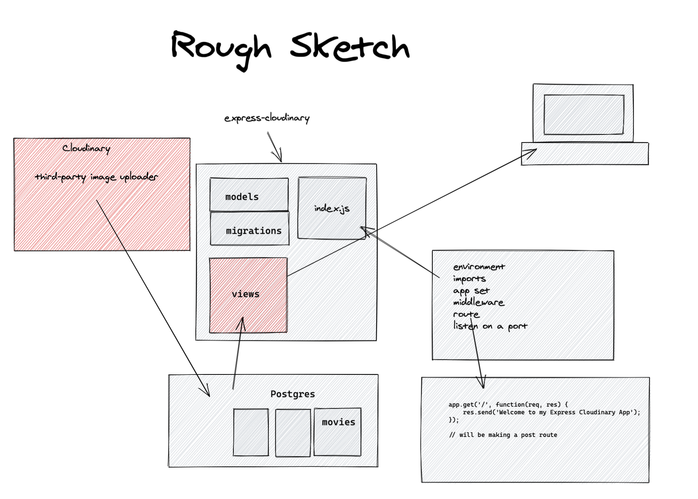
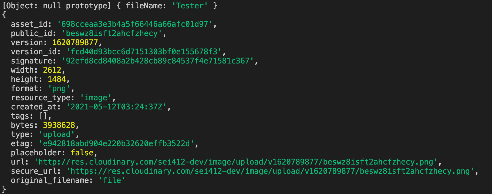

# express-cloudinary-412

## GOALS

- Demonstrate how to upload images directly from the app view using a form
- An easy to integrate tool for parsing our [form-data](https://developer.mozilla.org/en-US/docs/Web/API/FormData) in express (multer)
- A storage solution that will populate our db with urls / meta-data about our user uploads rather storing the image data itself.



## Lesson Scope

We will be covering the setup of our multer middleware and demonstrating how to integrate our express requests with the Cloudinary library. Additional extensions of the lesson are included below. 

## Setting up node project

1. Initalize the base express application by running `npm i` and `npm start`
1. Verify your index `GET` route is working

**Starter Files:**

<pre>
<code>

.
├── api-config.js
├── app.js
├── docs
│   └── ...
├── package-lock.json
├── package.json
├── readme.md
├── uploads
└── views
    ├── index.ejs
    └── layout.ejs

</code>
</pre>

### Initialize Server Application

**Code Sample for starter app**

```js
const express = require("express");
const app = express();
const PORT = process.env.PORT || 9000;
const ejsLayouts = require("express-ejs-layouts");

app.set("view engine", "ejs");

app.use(express.urlencoded({ extended: false }));
app.use(express.json());
app.use(ejsLayouts);

app.get("/", (req, res) => {
  res.render("index");
});

const server = app.listen(PORT);

server.on("listening", () => console.log(`Listening on port: ${PORT}`));
```
<br/>
<br/>

## Multer

### Installation of Multer

To install the Multer library run `npm install multer` and import the package into your express application file.

```js
// Multer is processing our multipart/form-data, which is primarily used for uploading files.
const multer = require("multer");

//Multer adds a body object and a file or files object to the request object.
//The body object contains the values of the text fields of the form.
//The file or files object contains the files uploaded via the form.


const upload = multer({ dest: 'uploads/' })

// Multer accepts an options object, the most basic of which is the dest property. 
// dest tells Multer where to upload the files. 
// In case you omit the options object, the files will be kept in memory and never written to disk.
```

### About Multer

Multer is a node.js middleware for handling multipart/form-data.
NOTE: Multer will not process any form which is not multipart (multipart/form-data).Multer is processing our multipart/form-data, which is primarily used for uploading files.

### Multer Routing Code

#### **singleFileUpload** (what we will be using)

```js
app.post('/single-file', upload.single('imageUpload'), function (req, res, next) {
    console.log(req.file)
    console.log(req.body)
    // req.file is the `imageUpload` file this string should match the name you specified on the upload input
    // req.body will hold the text fields, if there were any
    // our redirect after upload
    res.redirect('/')
  })
```

#### **multiFileUpload** ()

```js
app.post(
  "/photos/upload",
  upload.array("inputName", 6),
  function (req, res, next) {
    // req.files is array of `photos` files
    // req.body will contain the text fields, if there were any
    // our redirect after upload
    res.redirect('/')
  }
);
```

When you are configuring your form you will want to match the name of the `type=file` input to match the string you pass to the `upload` method

```html
<form action="/single-file" method="post" enctype="multipart/form-data">
  <label for="fileType"> File Name </label>
  <input id="fileType" type="text" name="fileName" />
  <br /><br />
  <input id="imageUpload" type="file" name="imageUpload" />
  <input type="submit" value="Upload" />
</form>
```

__Notes:__
- The form will only complete this request after a submit event is fired. Any meta-information you would like to attached to your request can be handled with various input fields.
- This information will be accessible from the request object via the `req.body` prop, and the file information from the `req.file` (single)/ `req.files` (multi) props. 
- The form `enctype="multipart/form-data"` attribute may be new, but allows us to configure our request/data-type and is _required_ if you want `multer` to work properly.
<br/>
<br/>

## Cloudinary

### About Cloudinary

Cloudinary is an end-to-end image- and video-management solution for websites and mobile apps, covering everything from image and video uploads, storage, manipulations, optimizations to delivery. It offers an api, but also has a node package that can easily integrate with our express application. We will be executing their code to dynamically stream the images we uploaded via our form (and Multer) to their cloud servers. 

### Installation of Cloudinary

To use the build Cloudinary's streaming tools we need to install two packages. 

```text
npm install cloudinary 
npm install streamifier
npm install dotenv
```

### Signing up for Cloudinary
You will need to create an account and configure the application your application to send authentication credentials with each request. After you have done so the process is pretty pain free. Instructions for setting up and configuring the application can be found in the Cloudinary documenation. 

1. [Integratation](https://cloudinary.com/blog/node_js_file_upload_to_a_local_server_or_to_the_cloud') 
2. [API-DOCS](https://cloudinary.com/documentation/node_integration)


After you setup your account you can return to your account dashboard to verify your security credentials/

### Setup of Cloudinary Integration

1. Create a config file 

```js
require('dotenv').config()

module.exports = {
    cloud_name: process.env.CL_NAME, 
api_key: process.env.CL_APIKEY, 
api_secret: process.env.CL_SECRET 
}

```

2. Store your authentication information provided by Cloudinary in an .env

```text 

CL_NAME=XXXXXXXXXXXXXX
CL_APIKEY=XXXXXXXXXXXXXX
CL_SECRET=XXXXXXXXXXXXXX

```
3. Make sure you have your `.env` files listed in your `.gitignore`

```text
node_modules
images/*
uploads/*

.DS_store
.env
```

Import your configuration along with the Cloudinary tools 
```js
const upload = multer()
// we remove the upload option so that the default datatype Multer provides is a buffer 

const cloudinary = require('cloudinary').v2
const streamifier = require('streamifier')
const clConfig = require('./cloudinary-config.js')

cloudinary.config(clConfig);
```

**Cloudinary Upload Code**

```js
app.post(
  "/single-file",
  upload.single("imageUpload"),
  function (req, res, next) {
    //this code is from the cloudinary documentation
    //('https://cloudinary.com/blog/node_js_file_upload_to_a_local_server_or_to_the_cloud' )

    //our uploading function that returns a promise and also streams the inputed files to the cloudinary servers using the streamifier package
    let streamUpload = (req) => {
      return new Promise((resolve, reject) => {
        let stream = cloudinary.uploader.upload_stream((error, result) => {
          if (result) {
            console.log(result);
            resolve(result);
          } else {
            reject(error);
          }
        });
        // our request objects file information is made available through the req.file.buffer
        streamifier.createReadStream(req.file.buffer).pipe(stream);
      });
    };
    // our initializer for the 'streamUpload process'
    async function upload(req) {
      let result = await streamUpload(req);
      // the variable result will return the resolved promise's result value (the object we see in our console)
      // the information from this object can then be made available to other parts of our application (ie Sequelize db methods)
      console.log(req.body);
      console.log(result);
      res.redirect("/");
    }
    // our synchronous function call that gets the whole process started
    upload(req);
  }
);
```


### RESPONSE from POST

After the response is made you will see the returned object from the Cloudinary API 



# Ways to extend this Lesson:
1. Integrate Sequelize into your application to update your an 'image_upload' table with data provided by the API
2. Migrate your Cloudinary functions into a separate module `util.js`
3. Refactor your code to modularize your routing in a controller
4. Style your form and add conditional rendering for single or multi-file uploads. 
